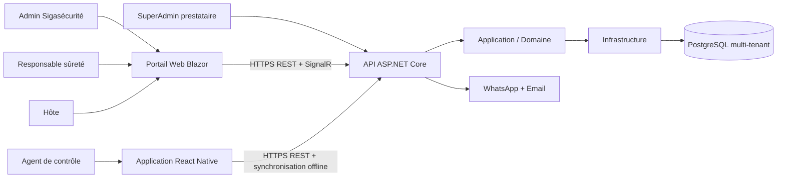
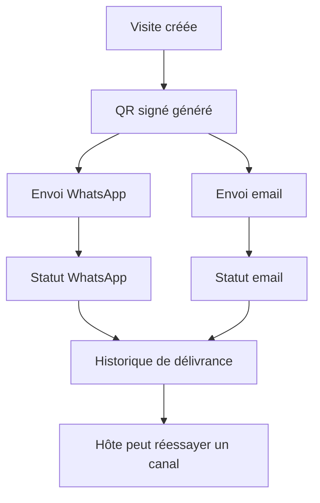

# NOVACCÈS — Workflow cible complet

Ce document décrit le fonctionnement cible de la plateforme Web + API + application mobile React Native. Le projet distingue le **SuperAdmin prestataire**, l’**Administrateur Sigasécurité**, le **Responsable sûreté**, l’**Hôte** et l’**Agent de contrôle**.

## 1. Architecture de référence



Les interfaces ne portent jamais les règles de sécurité. Elles appellent l’API, qui vérifie le rôle, le tenant, la période du QR, l’état de la visite et les droits de l’utilisateur.

## 2. Hiérarchie des rôles

| Rôle | Périmètre | Capacités principales |
|---|---|---|
| SuperAdmin prestataire | Plateforme entière | Tenants, provisioning, comptes Admin, supervision technique, support audité |
| Admin Sigasécurité | Tous les sites Sigasécurité | Sites, utilisateurs, agents, statistiques et paramètres métier |
| Responsable sûreté | Un site client | Exclusions, révocations, journal, visiteurs présents et alertes |
| Hôte | Ses propres demandes | Inviter, consulter, révoquer ou réinviter ses visiteurs |
| Agent | Poste/site autorisé | Scanner, enregistrer entrée/sortie, synchroniser le mode hors ligne |

Le visiteur n’a pas de compte. Il reçoit un QR signé et le présente au poste de contrôle.

### Règles d'administration et de traçabilité

- Le **SuperAdmin** peut créer tous les rôles, y compris un autre SuperAdmin.
- Aucun autre rôle ne peut créer, promouvoir ou voir un compte SuperAdmin.
- La liste `/api/admin/users` masque les SuperAdmins aux comptes non-SuperAdmin ; le SuperAdmin voit la liste complète.
- La suppression d'un compte est exclusivement un **self-delete** via `DELETE /api/auth/me` ; aucune route ne permet de supprimer le compte d'un autre utilisateur.
- Les retraits métier (exclusion, rétention, révocation) ne suppriment pas de comptes et restent audités comme des actions métier.
- Chaque requête API est inscrite dans le journal global append-only (`GET /api/audit/application`, SuperAdmin uniquement) ; les actions métier détaillées restent inscrites dans le journal du site.
- Le SuperAdmin peut extraire l'intégralité de la traçabilité en CSV via `GET /api/audit/application.csv`, avec filtres période, site et acteur.
## 3. Cycle d’installation initiale

1. Le SuperAdmin crée l’organisation cliente et son tenant.
2. L’API provisionne le schéma PostgreSQL isolé du client.
3. Le SuperAdmin crée le compte Admin Sigasécurité.
4. L’Admin crée les sites et les postes de contrôle.
5. L’Admin crée les responsables sûreté, hôtes et agents.
6. Le responsable sûreté configure les exclusions, jours fériés et paramètres de son site.
7. L’Admin génère un ticket QR temporaire pour le terminal ; le mobile le scanne une seule fois et active le device. L’agent prend ensuite son poste avec son matricule, son PIN et son site autorisé.
8. Chaque compte reçoit uniquement les permissions de son rôle.

## Enrôlement QR du terminal

- POST /api/admin/terminals : provisionne le terminal et ses sites autorisés.
- POST /api/admin/terminals/{id}/enrollment-ticket : génère un ticket QR valable quelques minutes.
- POST /api/device-enrollments/activate : consomme le ticket une seule fois, lie la clé publique du device et remet une nouvelle clé API.
- GET /api/keys/public : fournit la clé publique ES256 nécessaire au mode hors ligne.
- En cas de perte ou de remplacement : l'Admin révoque le terminal et génère un nouveau QR.
## 4. Connexion et sessions

### Web

- `POST /api/auth/login`
- `POST /api/auth/login/2fa` pour les comptes protégés par 2FA
- JWT court pour les appels API
- refresh token rotatif via `POST /api/auth/refresh`
- révocation via `POST /api/auth/logout`

La 2FA est obligatoire pour le SuperAdmin, l’Admin et le Responsable sûreté.

### Mobile

- `POST /api/auth/login` avec matricule, PIN et `X-Site-Id`
- réception d’un JWT agent et d’un refresh token
- vérification du site par le claim du token, jamais par un site arbitraire envoyé par le terminal

## 5. Création d’une visite

1. L’Hôte ouvre « Nouvelle demande ».
2. Il saisit le visiteur, l’entreprise, le motif, le rendez-vous, la durée, l’email et le numéro WhatsApp.
3. Il choisit :
   - accès unique : fenêtre `-20 min / +15 min` ;
   - accès 30 jours : jours ouvrés uniquement.
4. L’API vérifie la liste d’exclusion et les doublons actifs.
5. L’API crée la visite dans le tenant de l’hôte.
6. L’API génère un QR signé sans données personnelles en clair.
7. Le QR est envoyé **sur WhatsApp et par email**.
8. Chaque canal possède son propre statut : envoyé, échoué ou absent.
9. La visite reste valide même si un canal échoue.
10. L’Hôte peut afficher ou réenvoyer le QR depuis le Web.

## 6. Envoi du QR



Une panne WhatsApp ne doit pas empêcher l’email. Une panne email ne doit pas empêcher WhatsApp. En production, les tentatives devront être traitées par une file/outbox avec reprise automatique.

## 7. Contrôle à l’entrée

1. L’agent ouvre son poste et récupère la configuration du site.
2. L’application télécharge la liste locale signée des QR valides.
3. La liste est limitée par un TTL de quatre heures maximum.
4. L’agent scanne le QR.
5. En ligne, l’API vérifie :
   - signature et expiration ;
   - tenant et site ;
   - fenêtre horaire ;
   - exclusion ;
   - révocation ;
   - anti-rejeu ;
   - état déjà présent sur site.
6. L’application affiche un verdict plein écran : autorisé ou refusé.
7. Le verdict est accompagné d’un son et d’une vibration.
8. Le scan est journalisé avec l’agent, le poste, l’heure, le mode et le motif technique.

L’agent ne voit jamais le motif confidentiel d’une exclusion.

## 8. Mode hors connexion

1. L’application utilise uniquement la liste signée reçue avant la coupure.
2. Un QR absent de la liste est refusé hors ligne.
3. Une liste expirée bloque toute validation locale.
4. Les scans offline sont conservés localement avec leur verdict.
5. À la reconnexion, l’application appelle `POST /api/scan/sync`.
6. L’API rejoue chaque scan avec son horloge serveur.
7. Tout conflit anti-rejeu devient un événement de sécurité.
8. Une révocation émise pendant la coupure est appliquée à la synchronisation.

## 9. Contrôle à la sortie

- Le poste passe en mode « Sortie ».
- Un visiteur présent peut sortir même si son QR a été révoqué après son entrée.
- La sortie clôture le cycle de visite.
- Une sortie sans entrée active est refusée et journalisée.
- Une nouvelle présentation après sortie est traitée comme un rejeu ou une anomalie.

## 10. Supervision sûreté

Le Responsable sûreté peut consulter :

- les visiteurs présents ;
- les entrées et sorties ;
- les refus et événements de sécurité ;
- les scans hors ligne ;
- les visiteurs en dépassement de durée ;
- les QR actifs et leur révocation ;
- la liste d’exclusion ;
- l’export CSV.

Les hôtes reçoivent les événements concernant leurs propres visiteurs. Les événements sont diffusés en temps réel par SignalR, sans fuite entre tenants.

## 11. Administration

### Admin Sigasécurité

- gère les sites, utilisateurs et agents ;
- consulte la vue multi-sites ;
- configure les postes et paramètres métier ;
- supervise les statistiques opérationnelles.

### SuperAdmin prestataire

- provisionne les tenants ;
- supervise la santé de la plateforme ;
- gère les comptes Admin/SuperAdmin ;
- intervient en support avec une autorisation temporaire et un audit obligatoire ;
- ne consulte pas librement les données personnelles métier.

## 12. Contrat API principal

| Fonction | Route cible | Client |
|---|---|---|
| Authentification | `/api/auth/*` | Web + React Native |
| Création/consultation des visites | `/api/visits/*` | Web |
| Scan connecté | `/api/scan` | React Native |
| Configuration agent | `/api/site/config` | React Native |
| Liste offline signée | `/api/offline-list` | React Native |
| Synchronisation offline | `/api/scan/sync` | React Native |
| Dashboard | `/api/dashboard/*` | Web |
| Exclusions | `/api/exclusions/*` | Web sûreté |
| Administration | `/api/admin/*` | Web Admin/SuperAdmin |
| Temps réel | `/hubs/scan`, `/hubs/scan-events` | Web + mobile selon besoin |
| Santé API | `/api/health`, `/health` | Supervision |

Le client React Native doit être généré ou maintenu à partir du document OpenAPI, et non à partir de DTO C# partagés directement.

## 13. États métier principaux

```text
Demande créée
  → QR généré
  → WhatsApp/email en cours
  → QR actif
  → Entrée autorisée
  → Visiteur présent
  → Sortie enregistrée
  → Visite terminée

Branches possibles :
QR révoqué · QR expiré · QR consommé · exclusion · fraude · conflit offline
```

## 14. Maquettes à produire

### Web Blazor

- connexion et 2FA ;
- portail Hôte ;
- dashboard Responsable sûreté ;
- administration Sigasécurité ;
- console SuperAdmin ;
- historique de délivrance WhatsApp/email ;
- profils, sessions et audit.

### React Native

- enrôlement agent ;
- prise de poste et choix du site autorisé ;
- scanner QR ;
- verdict autorisé/refusé ;
- entrée/sortie ;
- liste attendue du jour ;
- mode dégradé et TTL ;
- file de synchronisation ;
- écran de conflits et reconnexion.

Cette maquette doit rester une représentation de l’API réelle : chaque bouton doit correspondre à un droit et à une route documentée.